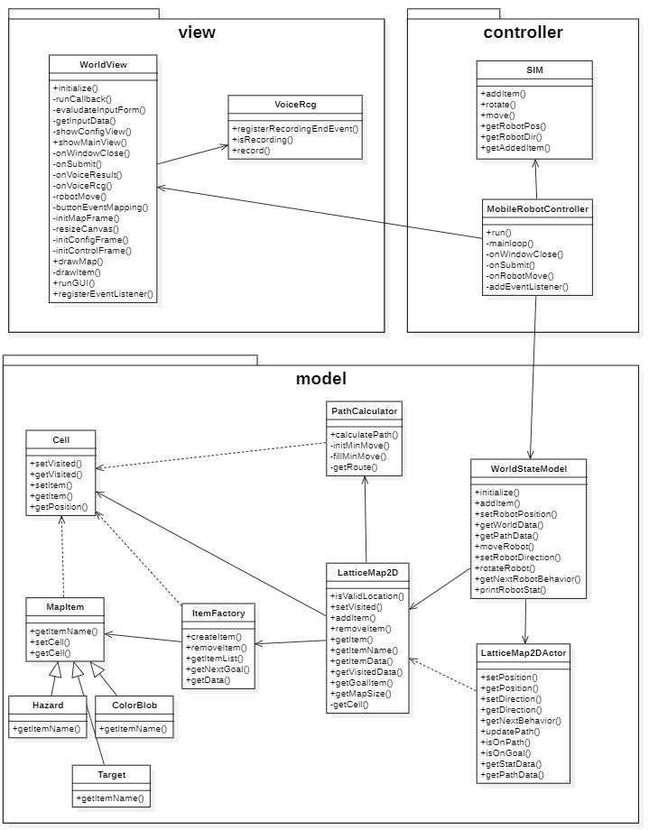

# Mobile Robot Controller

### Introduce
Team project of Software Engineering class in UOS

### Document


### How to install

1.  Move to the root folder
2.  Run commands below
```
pip install -r requirements.txt
python setup.py
```

### How to run
```
from mrc.controller.worldController import MobileRobotController
m = MobileRobotController() m.run()
```
### Class Diagram

